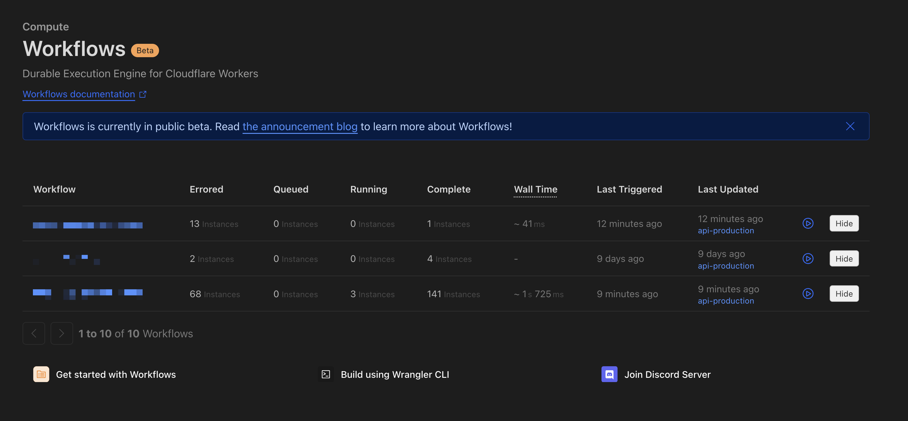

# Cloudflare Workflow Hider

A simple Chrome extension that allows you to hide Cloudflare workflows in their dashboard.

## Why?

Cloudflare currently doesn't support deleting workflows, which can lead to a cluttered dashboard. This extension lets you visually hide workflows you no longer need to see.

## Features

- Hide/show individual workflows with a click
- Persistent storage of hidden workflows
- Popup interface to see all hidden workflows
- Option to clear all hidden workflows at once

## Installation

Since this is not distributed through the Chrome Web Store, you'll need to install it manually:

1. Download or clone this repository
2. Open Chrome and go to `chrome://extensions/`
3. Enable "Developer mode" (toggle in the top-right corner)
4. Click "Load unpacked" and select the folder containing these files
5. The extension should now be installed and active

## Usage

1. Navigate to your Cloudflare Workers Workflows dashboard
2. Each workflow row will now have a "Hide" button
3. Click "Hide" to hide a workflow (it will disappear from the table)
4. Click the extension icon in your browser toolbar to see a list of hidden workflows
5. Use the "Clear All Hidden Workflows" button to show all workflows again

## Troubleshooting

If you don't see the "Hide" buttons:

1. Click the extension icon in your browser toolbar
2. Click the "Force Add Hide Buttons" button
3. Refresh the page if the buttons still don't appear
4. Make sure you're on the Cloudflare Workers Workflows dashboard page

## Notes

- This extension only affects the visual display of workflows in your browser
- It does not actually delete or modify any workflows on Cloudflare's servers
- Hidden workflows are stored in your browser's local storage
- This is for personal use only and not intended for distribution
